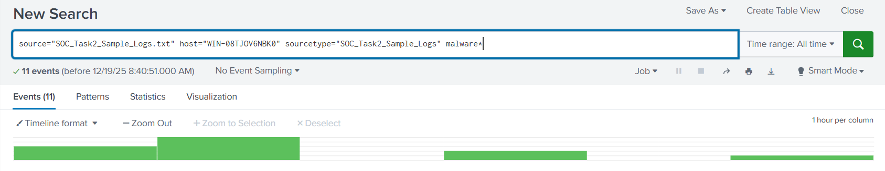
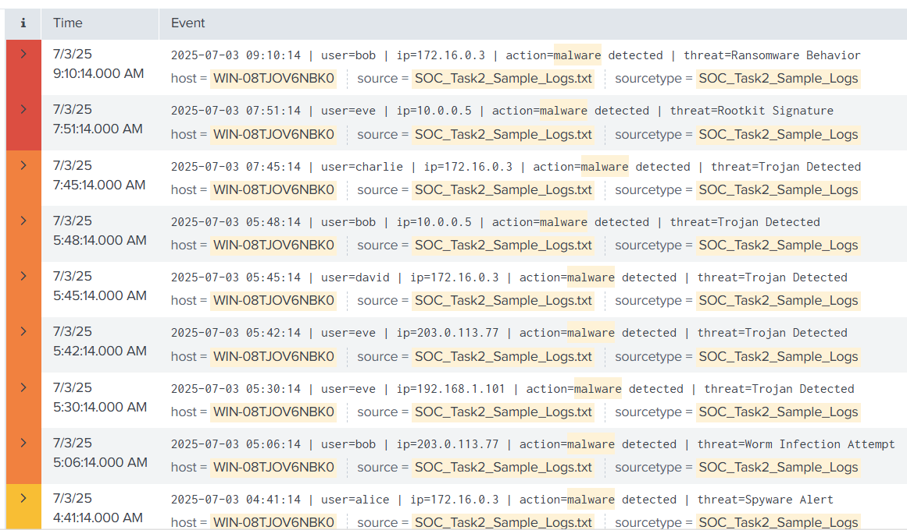
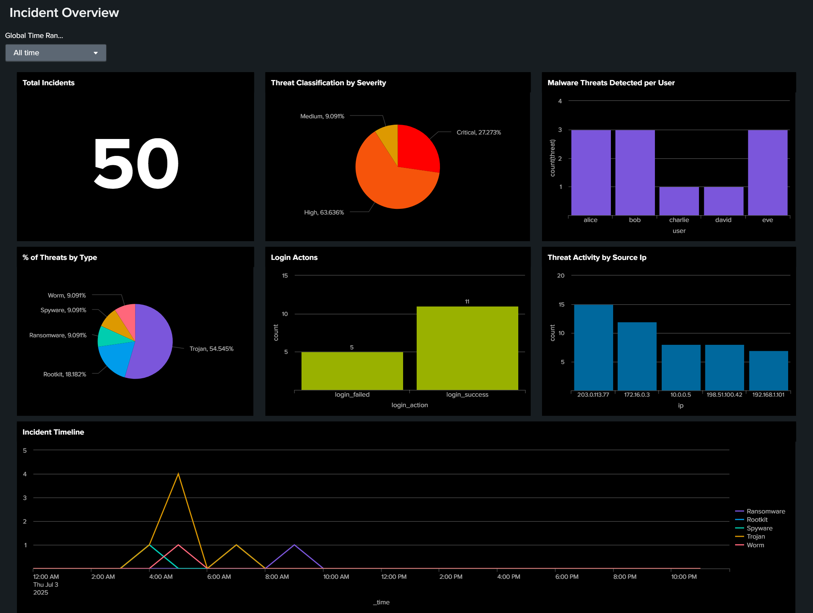
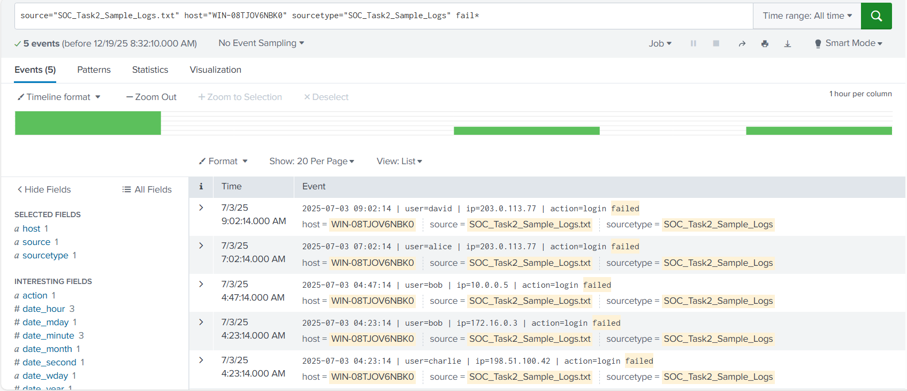

# FUTURE INTERNS - CYBERSECURITY
Task 2: Security Alert Monitoring &amp; Incident Response Simulation

## 📌 Project Overview
This project involved monitoring security alerts, and analysing potential threats on a host. A provided sample log was ingested into Splunk and I identified 5 distinct malware categories and prioritized them, to determine remediation urgency. This project also contains a detailed incident response report with remediation suggestions.

---

## 🛠️ Tools
* **Splunk SIEM:** Used for threat hunting via Search Processing Language (SPL).
* **Microsoft Excel:** Used for alert classification/prioritization.

---

## 🔍 Investigative Evidence

The investigation was conducted using a multi-layered approach, moving from technical search queries to high-level visualization and behavioral analysis.

### 1. Splunk Search Strategy (The Query)
I developed a **Master SPL Query** to isolate malicious event strings from the raw log data. This strategy focused on filtering the `action` and `threat` fields to identify specific malware signatures.

<b>Click to view Search Query Screenshot</b>

### 2. Detection Results (The Evidence)
The search results confirmed the presence of **5 distinct malware categories**. This raw evidence provided the basis for the subsequent triage and prioritization process.

<b>Click to view Detection Results Screenshot</b>

### 3. SIEM Dashboard (The Visualization)
To improve incident visibility, I utilized a **SIEM Dashboard** that aggregated the findings into visual charts, allowing for a faster assessment of the host's overall security posture.

<b>Click to view Dashboard Screenshot</b>

### 4. Secondary Security Findings (Logons & Network)
A review of authentication logs revealed suspicious failed login patterns. These findings suggest potential brute-force attempts which may have served as the initial entry vector for the identified malware.

<b>Click to view Secondary Findings Screenshot</b>

---

## 📂 Deliverables

### 📝 Reports & Logs
* **[Incident Response Report (PDF)](./Reports/Incident_Response_Report.pdf):** Detailed analysis, findings, and remediation strategies.
* **[Alert Classification Log (MD)](./Logs/Alert_Classification.md):** A technical mapping of alerts to severity and priority levels.

### 🖼️ Visual Evidence
* **[Analyzed Alerts & SIEM Dashboard](./Screenshots/):** Full directory containing evidence of the analysed malwares, failed login patterns and the Dashboard overview .

---

## 🚦 Skills Demonstrated
* **SIEM Proficiency:** Developing complex SPL queries to isolate malicious event strings.
* **Threat Classification:** Categorizing 5 malware types based on behavioral impact and persistence.
* **Incident Prioritization:** Implementing a 3-tier triage system (Critical, High, Medium) to guide response teams.
* **Data Transparency:** Maintaining raw text logs to ensure investigation integrity.
